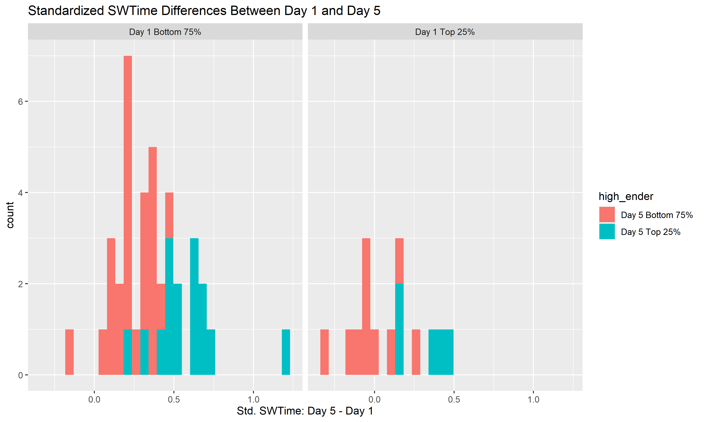

```{r setup, include=FALSE}
knitr::opts_chunk$set(echo = TRUE)
```

## Preprocessing Data

- Binarizing connectome matrices (using chosen thresholds)
```{r mean_dist_png, echo=FALSE, message=FALSE, warning=FALSE, out.width = '49%',out.height="20%,fig.show='hold',fig.align='center'}
knitr::include_graphics(c("Frances/plots/variance_heatmap.png","Frances/plots/var_heatmap_bin.png"))
```


## Memory Metrics
- Long term memory (across days) vs. short-term memory (across trials)
\pause
- Mean standardized SW times/distances for each animal

```{r mean_dist_png, echo=FALSE, message=FALSE, warning=FALSE, out.width = '80%'}

```

## Memory Metrics (cont.)
- Which mice show the most time/distance improvement?
- Account for lucky mice on the first day
\pause

```{r mean_dist_png, echo=FALSE, message=FALSE, warning=FALSE, out.width = '75%'}
knitr::include_graphics("Frances/plots/swdist_diffs.png")
```
## Memory Metrics (cont.)

```{r mean_dist_png, echo=FALSE, message=FALSE, warning=FALSE, out.width = '75%'}

```

-Differences of target times/distances appear roughly normal 

## The Model 

- $f(B_i | y_i)$ or $f(y_i | B_i)$?
\pause
- We identify the rats with the highest and lowest values of the relevant trait and label the networks associated with these rats $B_1$ and $B_0$
\pause
- $P(\Psi, \beta | (B_i, y_i)) \propto \prod_{i=1}^n P(B_i | Y_i, \Phi, \beta)P(\Psi)P(\beta) =$

- $\prod_{i=1}^n  (\Phi(y_i\beta)f(B_i; B_1) + (1-\Phi(y_i\beta))f(B_i; B_0))P(\Psi)P(\beta)$
\pause
- $\Psi = \begin{pmatrix} \psi_{00} & \psi_{01} \\ 
\psi_{10} & \psi_{11} \end{pmatrix}$
\pause
- $f(B_i; B_0) = \prod_{j=1}^R \prod_{l<j}        \psi_{00}^{1(B_i[j,l]=1,B_0[j,l]=0)}\psi_{01}^{1(B_i[j,l]=0,B_0[j,l]=1)}$

- $f(B_i; B_1) = \prod_{j=1}^R \prod_{l<j} \psi_{10}^{1(B_i[j,l]=1,B_1[j,l]=0)}\psi_{11}^{1(B_i[j,l]=0,B_1[j,l]=1)}$
\pause
- Introduce latent component indicators $C_i$ and probit regression variables $Z_i$. 
