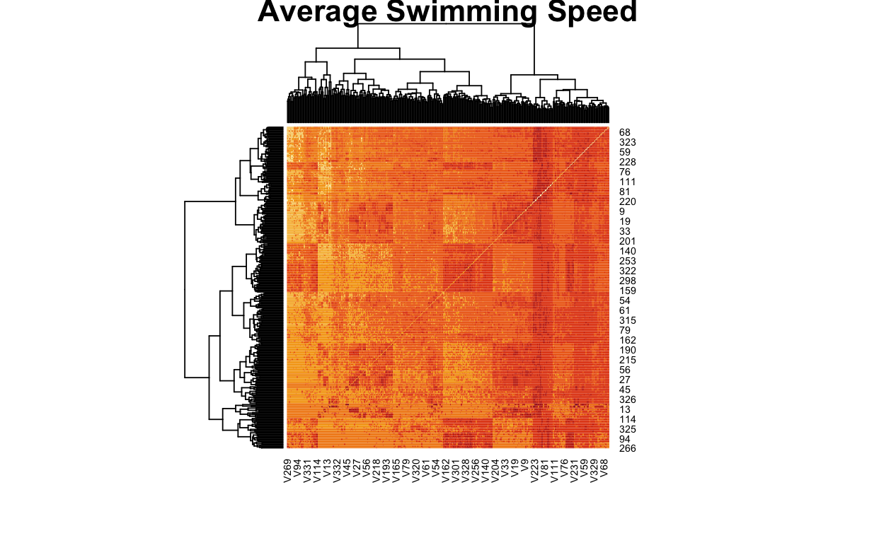
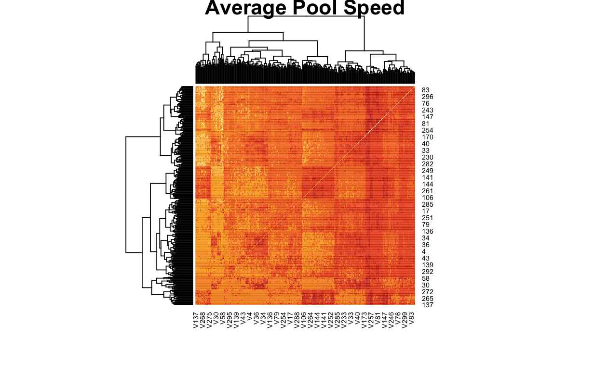

\fontsize{10}{11}
\selectfont

```{r setup, include=FALSE}
knitr::opts_chunk$set(echo = TRUE)
```

#### Abstract
For diagnosing and predicting behaviorial changes, scientists are often interested in seeing how observed behavior is correlated with different brain structures. In this case study, we cluster mice brain structures into two groups corresponding to high-performing and low-performing memory scores.  

### Introduction

Finding relationships between brain structure and physiological behavior is of great interest for proactively diagnosing conditions like autism and attention deficit disorders. In our study of interest, researchers ran experiments on 55 mice to test their memory capacity and then measured the white brain matter connections between different brain structures. The main memory experiment consisted of putting the mice in a water maze and seeing how long and far they swam in a target quadrant. The time and distance swum in the quadrant were recorded over four daily trials and five days for each mouse. 

The white brain matter connections are represented as a $332 \times 332$ connectome matrix for each mouse. Each of the indices represents a different structure in the brain; we can assign hierarchical labels to these structures. 

### EDA 

Our goal is to find a connection between different mouse brain structure connections and memory capacity. A natural initial analysis is therefore to look at the variance in mouse brain structures. We focus on variance in mouse connection existence as opposed to mouse connection strength. This entails binarizing the connectome matrices so that each connectome entry is $0$ if the white matter connections exceed a chosen threshold (for now, 1) and $1$ otherwise. Binarizing matrices in this way results in drastically different entry-wise variances among the different connectomes, so further work entails carefully choosing thresholds for binarizing our connectomes (Fig. 1).

We additionally explore good memory measures for the 55 subjects. Because of different mouse swimming speeds and differences in total distance swum over each day, we consider the standardized times and differences for each mouse. We see that improvement of these standardized measures over the five days is a possible simple proxy for memory score, as long as we also take into account the relative individual performance on the first day (Fig. 2). Other proxies for memory score which we ended up using in our model included the averaged standardized pool times.

### Model

There are two distinct ways of modeling the relationship between a rat's brain connectome and a distinct phenotype. We can specify a likelihood for the trait conditional on the network (which usually involves collapsing the network into a series of summary statistics or fully vectorizing it), or look at the form of the network conditional on the trait. The latter may seem untenable at first - How can one specify complex brain structures based on a one dimensional measured attribute (memory in our case) without making many simplifying assumptions? - but we approached it using a novel method that takes advantage of the data to specify the likelihood. The inspiration for our model arises from the idea that, while there isn't much information apriori for defining a probability model for networks conditional on traits, there is a lot of structure in the data that can contextualize brain variation across rats. In order to operationalize this shared structure, we identify the rats with the highest and lowest values of the relevant trait. We label the networks associated with these rats $B_1$ and $B_0$ respectively and define the model as follows:

$$P(\Psi, \beta | (B_i, y_i)) \propto \prod_{i=1}^n P(B_i | Y_i, \Phi, \beta)P(\Psi)P(\beta) = \prod_{i=1}^n  (\Phi(y_i\beta)f(B_i; B_1) + (1-\Phi(y_i\beta))f(B_i; B_0))P(\Psi)P(\beta)$$
where

$$\Psi = \begin{pmatrix} \psi_{00} & \psi_{01} \\ 
\psi_{10} & \psi_{11} \end{pmatrix}$$

$$f(B_i; B_0) = \prod_{j=1}^R \prod_{l<j}        \psi_{00}^{1(B_i[j,l]=1,B_0[j,l]=0)}\psi_{01}^{1(B_i[j,l]=0,B_0[j,l]=1)}$$
$$f(B_i; B_1) = \prod_{j=1}^R \prod_{l<j} \psi_{10}^{1(B_i[j,l]=1,B_1[j,l]=0)}\psi_{11}^{1(B_i[j,l]=0,B_1[j,l]=1)}$$

Generally this likelihood models every network as an average of the two extremal networks weighted by how close they are (how many edges have to be removed or added in order to get from one network to the other) to the two data defined extremes. The $\Psi$ parameters indicate how dense the clusters around the minimum and maximum are and the $\beta$ parameter indicates whether or not there is a relationship between the trait and brain structure. Not only is this model easily interpretable, it is also possible to find all the full conditionals in closed form if we introduce two latent variables, the component indicators (if we think of each $f(B_i,B_0),f(B_i, B_1)$ as the two components of a mixture model) and the probit regression variable (standard in probit models), making posterior calculations straightforward using Gibbs Sampling.

### Results 

In this extremal network model, there are two clusters induced by $B_1$ and $B_0$ respectively. The former cluster is a cluster that is centered at $B_1$, while the latter one is centered at $B_0$. We choose $B_1$ to be the network of which subject has the best performance (highest swimming speed/ highest pool speed), and $B_0$ to be the network of which subject has the worst performance (lowest speed). Therefore, the cluster centering at $B_1$, hereinafter refer to as $cluster_{best}$, is presumably the network cluster that contains high performance networks.  

One quantity that is of interest is the posterior membership probability of every $B_i$, i.e., $Pr(B_i\in cluster_{best}|y)$. If this quantity is high, the network $B_i$ is highly related to the best performance cluster and vice versa. To find out the pattern of high performance cluster, we compute an $R\times R$ score matrix using the average of networks weighted by $Pr(B_i\in cluster_{best}|y)$:
$$
score=\sum_i Pr(B_i\in cluster_{best}|y)\times B_i
$$
In this equation, we use the weight $Pr(B_i\in cluster_{best}|y)$ because $B_i$ should contribute more to the pattern of high performance cluster if $B_i$ is more related to such cluster. A high value of the $(i,j)$ entry of this score matrix indicates that the connection between region $i$ and $j$ is highly related to the high performance.

We first choose the average swimming speed as $y_i$ and find out the connectome pattern that is related to a high swimming speed. We average the swimming speed of each subject $i$ and choose this average as $y_i$. We use a Gibbs sampler as discussed with 10000 iterations to fit this extremal model and compute the score matrix on the log scale. A hierachical clustering is also used to identify clusters in the connectonme data. The result is shown in Figure 3. We find that some regions almost always display high connectivity with other regions. These regions are $\{223,81\}$. We also identify some connectome clusters that are related to high swimming speed by reading off the clustering result of this heatmap.

Next, we choose the average pool speed as the response and use the similar setup to find out the pattern of high pool speed. The results are shown in Figure 4. Similarly, there exists some regions that have high connectivity with all other regions. These regions are $\{173,251,81\}$. Again the region cluster that are realated to high pool speed can be identified by reading off the heatmap.


### Discussion

By building an extremal network model, we identify regions clusters that are related to high swimming speed or high pool speed. Our method can be improved in several aspects. The threshold to binarize the network can be tuned to examine how our method is sensitive to the choice of threshold. The way to calculate the posterior score as discussed in the result section should be further examined, because there exists a possibility that the response variable has no significant effect on the clustering of networks. In this case, it is not very meaningful to calculate the score using an average of networks weighted by posterior membership probability. Moreover, our method is sensitive to the choice of extremal networks. If these extremal networks are noisy, our method will also be highly affected by the noise.  

### Appendix

#### Figure 1
```{r var_heat_png, echo=FALSE, message=FALSE, warning=FALSE, out.width = '45%',out.height='60%',fig.show='hold'}
knitr::include_graphics(c("Frances/plots/variance_heatmap.png","Frances/plots/var_heatmap_bin.png"))
```


#### Figure 2
```{r std_dist_diff_png, echo=FALSE, message=FALSE, warning=FALSE, out.width = '45%'}
knitr::include_graphics(c("Frances/plots/swdist_diffs.png","Frances/plots/swtime_diffs.png"))
```

#### Figure 3
```{r, echo=FALSE, message=FALSE, warning=FALSE, out.width = '85%'}

```

#### Figure 4
```{r, echo=FALSE, message=FALSE, warning=FALSE, out.width = '85%'}

```
